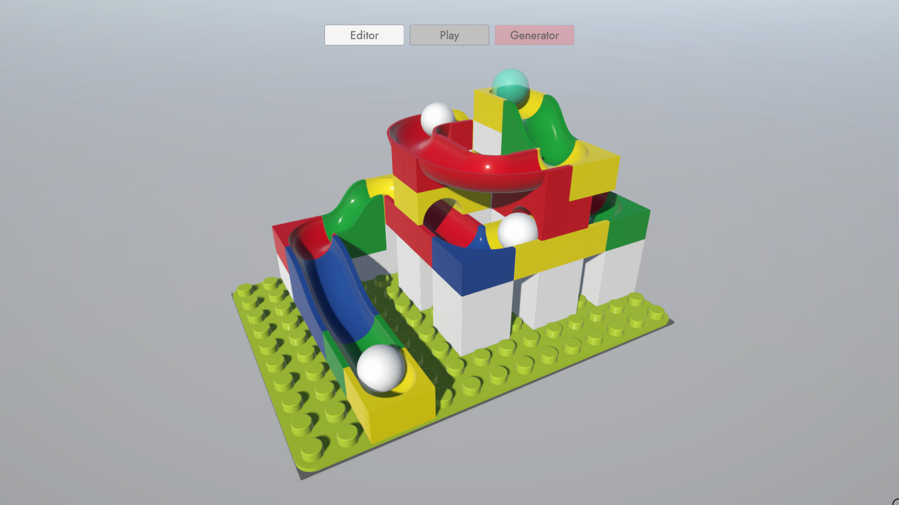

# HubelinoGenerator-Build
This repository contains Unity build of Hubelino Generator app.

## Features
- [x] Basic editor functions (placing, removing, coloring)
- [x] Changing size and building set 
- [x] Ghost guidance when placing
- [x] Undo/Redo
- [x] Exact collisions for placed parts
- [x] Connectors system
- [x] Run validation
- [x] Playing mode
- [ ] Generating runs
- [ ] Assisted building mode
## Controls
### Camera
WSAD - move  
Middle mouse hold - rotate  
Ctrl + right mouse - zoom  
Ctrl + left mouse - pan  
### Editor
Left mouse - action  
Right mouse - part rotation  
Scroll wheel - part select  
### Shortcuts
Z/Y - undo/redo  
Tab - place/remove toggle  
Keys 1-4 - mode select  
